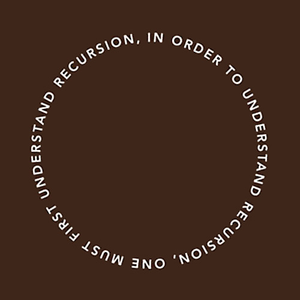

# Promises in Angular

Learn how promises are integrated into Angular and how to use them.

**Recommended reading**

* [Promises](../js-promises/)
* [Angular](../angular/)

<!-- START doctoc generated TOC please keep comment here to allow auto update -->
<!-- DON'T EDIT THIS SECTION, INSTEAD RE-RUN doctoc TO UPDATE -->


- [Promises in Angular](#promises-in-angular)
- [The `$q` service](#the-q-service)
  - [Creating promises with `$q`](#creating-promises-with-q)
  - [Transforming asynchronous callbacks into promises](#transforming-asynchronous-callbacks-into-promises)
  - [Do not overuse deferred objects](#do-not-overuse-deferred-objects)
- [Promises and `$http`](#promises-and-http)
  - [Sequential HTTP requests](#sequential-http-requests)
  - [Recursive HTTP requests](#recursive-http-requests)

<!-- END doctoc generated TOC please keep comment here to allow auto update -->


## Promises in Angular

Promises are common in Angular.

For example, the `$http` service **returns a promise** when you call it:
a promise that will be **resolved** with the server's HTTP response when it's available,
or **rejected** if the requests times out or the status code sent by the server indicates an error (e.g. 4xx or 5xx).

Many popular Angular libraries also return promises.


## The `$q` service

You **MUST NOT** use native ES6 promises in Angular.
They are not integrated into the Angular digest cycle which makes two-way binding possible.

Instead, you should use the [$q][angular-q] service provided by Angular,
which is a [Promises/A+][promises-spec]-compliant implementation of promises inspired by the popular promise library [q][q].


### Creating promises with `$q`

If you have an asynchronous operation or piece of code that **does not already return a promise**,
here's a few ways you can create promises with the `$q` service:

<!-- slide-column -->

```js
// Create a resolved promise
var promise = `$q.when('foo')`;
promise.then(function(result) {
  console.log(result); // 'foo'
});
```

<!-- slide-column 55 -->

```js
// Create a rejected promise
var promise = `$q.reject(new Error('bug'))`;
promise.catch(function(err) {
  console.log(err.message); // 'bug'
});
```

<!-- slide-container -->

```js
// Execute asynchronous operations in parallel
var usersPromise = $http({ url: '/users' });
var itemsPromise = $http({ url: '/items' });

`$.all([ usersPromise, itemsPromise ])`.then(function(results) {
  var users = results[0];
  var items = results[1];
  // ...
});
```

Don't forget to inject `$q` into your controller/service/etc.


### Transforming asynchronous callbacks into promises

Let's suppose you have a piece of code using **custom callbacks**,
like a call to retrieve the user's location with the HTML5 geolocation API:

```js
navigator.geolocation.getCurrentPosition(function successCallback(data) {
  // Do stuff with data
}, function errorCallback(err) {
  // Handle the error
});
```

How can you **make it a promise** to benefit from promise chaining, composition and error handling?

This is how you would do it with **ES6** promises
(**DO NOT** do this in Angular):

```js
function getPicture() {
  return `new Promise`(function(`resolve`, `reject`) {
    navigator.geolocation.getCurrentPosition(function successCallback(data) {
      `resolve(data)`;
    }, function errorCallback(err) {
      `reject(err)`;
    });
  })
}
```

#### Deferred objects

The `$q` service allows you to create a **deferred object**, let's call it `deferred`:

```js
var deferred = $q.defer();
```

This object contains a **promise** that you can retrieve and return with `deferred.promise`.
You can **resolve or reject** that promise with the deferred object's `resolve()` or `reject()` functions:

```js
var promise = deferred.promise;
if (allGood) {
  deferred.resolve('Yeehaw!');
} else {
  deferred.reject(new Error('Oops'));
}
```

#### Deferred object example

Here's how you would transform the asynchronous geolocation call with **callbacks into a promise**:

```js
function getPicture() {
  var `deferred` = `$q.defer()`;
  navigator.geolocation.getCurrentPosition(function successCallback(data) {
    `deferred.resolve(data)`;
  }, function errorCallback(err) {
    `deferred.reject(err)`;
  });
  return `deferred.promise`;
}
```


### Do not overuse deferred objects

Why is this stupid?

```js
function getUserFromServer() {
  var deferred = $q.defer();

  $http({ url: '/users' }).then(function(res) {
    deferred.resolve(res);
  }).catch(function(err) {
    deferred.reject(err);
  });

  return deferred.promise;
}

getUserFromServer().then(function(users) {
  // Do something with "res.data"...
});
```

#### Do not make it a promise if it's one already

The `$http` service **already returns a promise**,
you don't have to make a new one.
Just **chain it**:

```js
function getUserFromServer() {
  return $http({ url: '/users' });
}

getUserFromServer().then(function(res) {
  // Do something with "res.data"...
});
```


## Promises and `$http`

The `$http` service returns a promise when you use it:

```js
var promise = $http({
  url: '/items'
});
```

It is **resolved** with the HTTP response object when the request completes successfully:

```js
promise.then(function(res) {
  console.log(res.data); // [ 'foo', 'bar', 'baz' ]
});
```

Or **rejected** if the request times out or the server sends a status code indicating an error.
The HTTP response is provided as the reason:

```js
promise.catch(function(res) {
  console.log(res.status); // 422
  console.log(res.statusText); // Unprocessable Entity
});
```


### Sequential HTTP requests

HTTP requests are asynchronous, so to make several requests **sequentially**,
you have to wait until each request is done to trigger the next one:

```js
`$http`({
  method: 'POST',
  url: '/users',
  data: userData
}).then(function userCreated(res) {
  return `$http`({
    method: 'POST',
    url: '/auth',
    data: userData
  }).then(function userAuthenticated(res) {
    return `$http`({
      url: '/users/' + res.data.id + '/stats'
    }).then(function userStatsRetrieved(res) {
      // Do something with "res.data"...
    });
  });
}).catch(function(err) {
  $log.error(err);
});
```

That's not very easy to read.

#### Flattening sequential HTTP requests with chained promises

```js
function createUser(userData) {
  return $http({ method: 'POST', url: '/users', data: userData })
    .then(function() {
      return userData;
    });
}

function authenticateUser(userData) {
  return $http({ method: 'POST', url: '/auth', data: userData })
    .then(function(res) {
      return res.data.id;
    });
}

function getUserStats(userId) {
  return $http({ url: '/users/' + userId + '/stats' });
}

var userData = { name: 'jdoe', password: 'letmein' };

*createUser()
* .then(authenticateUser)
* .then(getUserStats)
* .then(function(res) {
*   // Do something with "res.data"...
* }).catch(function(err) {
*   $log.error(err);
* });
```


### Recursive HTTP requests

What if you are getting items from a paginated collection and want to fetch all of them?

<!-- slide-column -->

```js
function fetchAllItems(page, items) {
  page = page || 1; // Start from page 1
  items = items || [];

  // GET the current page
  return $http({
    url: '/items',
    params: {
      page: page
    }
  }).then(function(res) {
    if (res.data.length) {
      // If there are any items, add them
      // and recursively fetch the next page
      items = items.concat(res.data);
      return fetchAllItems(page + 1, items);
    }
    return items;
  });
}

fetchAllItems().then(function(allItems) {
  // Do something with "allItems"...
});
```

<!-- slide-column 40 -->




[angular-q]: https://docs.angularjs.org/api/ng/service/$q
[promises-spec]: https://promisesaplus.com
[q]: https://github.com/kriskowal/q
