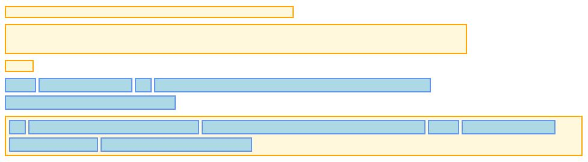
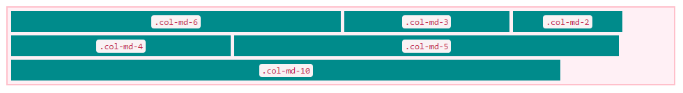

# Bootstrap - Layout management

<!-- slide-include ../../BANNER.md -->

Learn how Bootstrap helps you structure your HTML layouts, using both its grid system and all available responsive classes.

**You will need**

* [Google Chrome][chrome] (recommended, any browser with developer tools will do)
* [Sublime Text][sublime] (recommended, any code editor will do... **except Notepad**)

**Recommended reading**

* [Project setup][projset]
* [Bootstrap][bootstrap]

<!-- START doctoc generated TOC please keep comment here to allow auto update -->
<!-- DON'T EDIT THIS SECTION, INSTEAD RE-RUN doctoc TO UPDATE -->


- [Example file](#example-file)
- [Default HTML layout](#default-html-layout)
  - [Altering the default layout](#altering-the-default-layout)
- [Grid systems](#grid-systems)
- [Bootstrap Grid System](#bootstrap-grid-system)
  - [Creating `.row`](#creating-row)
  - [Adding columns](#adding-columns)
  - [Responsivness](#responsivness)
  - [Responsive utilities](#responsive-utilities)
- [Resources](#resources)

<!-- END doctoc generated TOC please keep comment here to allow auto update -->

## Example file

This subject will use [this `index.html` file][bsef] as illustration.

Be sure to download it, if you want to try and follow with the examples.

<!-- slide-front-matter class: center, middle -->

## Default HTML layout

The default layout of an HTML page is very simple: it's almost inexistant.

* ![][block] **Block elements** (such as `<div>`, `<p>`, `<table>`) start a new "line" and are stack on one another.
* ![][inline] **Inline elements** (such as `<span>`, `<a>`, `<button>`) are placed one after another in the same "line".

> You can place inline elements inside block elements.
> 
> This is called the **flow of the page**.

<p class="center"></p>

### Altering the default layout

CSS offers a bunch of properties to alter this default behavior, allowing for more creative and custom page layouts.

> We won't see these properties in detail in this course.

* `display`: you can force an inline component to behave like a block element, and *vice-versa*.
* `float`: you can force-push an element to either the left-side or the right-side of the page. This pull the element out of the flow.
* `position`: you can force an element to a special position (*`fixed`, `absolute`, `relative`*), that can pull it out of the flow.

Using these properties can be quite tedious, especially if you want something **stable and compatible** with all browsers.

> A new layout paradigm, called **FlexBox** has been introduce with CSS3.
> 
> It offers a very flexible and powerful way to create layouts, and a great consistency regarding the positionning of elements.

## Grid systems

<!-- slide-column -->

A Grid System is a way of creating layouts that's been inherited from graphic designers.

The idea is quite simple: you divide the space at your disposal in **columns** (usually an even number), separated by a **gutter**.

When you place your elements on the layout, they **must** be as wide as one or more columns.

<!--slide-column -->

<p></p>

<!-- slide-container -->

> An element mustn't stop in the **middle of a column**. That would completely defeat the purpose of having a grid system in place.

> A Grid System only **constrain the width** of an element. Its height is still **calculated based on its content**.

## Bootstrap Grid System

Bootstrap includes a grid system that is very easy to use and very flexible.


Here are some "rules" to follow for using the Grid System:
* You must use the grid system **inside an element** with `.container` or `.container-fluid` class.
* The grid is divided in **12 columns maximum**, whatever's the screen width.
* You **don't have to use it everywhere** on your page. You can for example use it inside one `<div>` in particular, and completely leave it aside for the next one.
* It was built having **mobile and tablet in mind**, so it offers easy **responsivness** for your layouts.

To use this grid system in your layout, you have a dozen classes at your disposal.

### Creating `.row`

The `.row` class is used to "activate" the grid system somewhere in your layout.

> To have proper spacing, add this class only to elements that are inside elements with the `.container` or `.container-fluid` class.

Let's add a row around the *Lists* section in our `index.html` file:

```html
*<div class="row">
  <h2>Lists</h2>
  <div class="list-group">
    <!-- first list -->
  </div>
  <div class="list-group">
    <!-- second list -->
  </div>
*</div> 
```
> It's usually a good practice to use a new `<div>` to define a new `.row`. This helps avoiding strange behaviors regarding padding and margin.

<!-- slide-notes -->

You'll see that everything inside the new row is **now wider than the rest of the content**. This is because the `.row` class **cancel** the `padding` of the `.container` class. Defining the column will **solve** the *problem*.

### Adding columns

Now that we have defined a *column container* (i.e. the `.row` element), next step is to define the width (in number of columns) of each element in the `.row`.

This is done by using a special set of classes: `.col-md-*`.

> The `*` in the name must be replaced by the number of columns on which the element should span.

For example, we would like our *Lists* title to span on all 12 columns...

```html
<h2 `class="col-md-12"`>Lists</h2>
```
... and both our lists to be half-width wide, that is span on 6 columns each:

```html
*<div class="col-md-6">
  <div class="list-group"><!-- first list --></div>
*</div>
*<div class="col-md-6">
  <div class="list-group"><!-- second list --></div>
*</div>
```
> Only elements with a `.col-*-*` class should be immediate children of a `.row`.

<!-- slide-notes -->

Here, we've wrapped our `<div class="list-group">` element with another `<div>` on which we applied the `.col-md-6` class. That's because its padding and margin is interfering with the `padding` and `margin` of the `.list-group` class.

> Generally, it's a good practice to add a new `<div>` element to define columns.

#### Column wrapping

If you look closely at the previous example, you might see something apparently odd.

We have an `<h2>` that's **12 columns wide** and two `<div>` that are **both 6 columns wide**. That makes up a total of **24 columns** for the row.

> Didn't you say that a `.row` has a maximum of 12 columns?!

Indeed. But when the number of columns in a row is **more than 12**, Bootstrap will **wrap all elements** causing the excess on a **new 12-columns-wide line**.

> This is very useful! With this behavior, you **don't have to constantly calculate** the number of columns in a row.

> Just define **one** row, and add **as many columns as you want**; they will be properly placed and spaced.

<p class="center"></p>

#### Offseting columns

Another grid functionnality offered by the Bootstrap Grid System is **offsetting columns**.

Let's say that we want the *Icons* section and the *Buttons* section of the `index.html` to be **on the same row**, with both a **4-columns width**, but the former **aligned to the left**, and the latter **aligned to the right**.

We would need to offset our *Buttons* section by **4 columns** to achieve that. And this can be done by using the `.col-md-offset-*`:

```html
<div class="row">
  <div class="col-md-4">
    <h2>Icons</h2>
    <div>
      <!-- Icons content -->
    </div>
  </div>
  <div class="col-md-4 `col-md-offset-4`">
    <h2>Buttons</h2>
    <div>
      <!-- Buttons content -->
    </div>
  </div>
</div>
```
<!-- slide-notes -->

The `*` is to be replaced by the number of columns you want to offset your element.

### Responsivness

As said before, Bootstrap was build **with smartphones and tablets in mind**, and this is especially visible with the Grid System.

Until now, we have only used the `.col-md-*` set of classes to position our element on the grid. 

But there is actually **4 sets of classes available**, each of them being activated when the user's screen (or window) has a **certain width**:

| Classes name  | Screen width   |
| :------------ | :------------- |
| `.col-xs-*`   | < 768px        |
| `.col-sm-*`   | &#8805; 768px  |
| `.col-md-*`   | &#8805; 992px  |
| `.col-lg-*`   | &#8805; 1200px |

Using these classes you can dramatically alter the layout of your page, depending on the width of the screen it's rendered on.

#### Example

To see by ourselves how this works, let's modify the `<p>`s in the *Color classes* section.

Add these classes in the `class` attribute of all the `<p>`:

```html
<p class="... `col-lg-2 col-md-3 col-sm-4 col-xs-6`"><!-- content --></p>
```
> What does this mean?

* `.col-lg-2` The content will be 2-column-wide on large screens
* `.col-md-3` The content will be 3-column-wide on middle screens
* `.col-sm-4` The content will be 4-column-wide on small screens
* `.col-xs-6` The content will be 6-column-wide on extra-small screens

> Go ahead. Try to resize your browser (using the Developer Tools of Chrome) and see how the content behave.

#### What if..?

What if you want your `<p>`s to be **3-column-wide** for every screen widht, except on **extra-small ones**, where they should be **6-column-wide**?

Maybe you'd do something like this:

```html
<p class="... `col-lg-3 col-md-3 col-sm-3 col-xs-6`"><!-- content --></p>
```
> You can see that we have a lot of redundancy: `.col-lg-3`, `.col-md-3` and `.col-sm-3` all do basically the same thing.

Good news is: we can get rid of this apparent redundancy.

> Each screen-dependant class is activated when the screen has the correct widht **or is wider** (*unless you defined otherwise*).

In this case, doing this would have the same result:

```html
<p class="... `col-sm-3 col-xs-6`"><!-- content --></p>
```

> Since we didn't define any behavior for `lg` and `md` screen, Bootstrap will fallback to the closest one, which is `.col-sm-3`.

#### Flexibility

You don't have to use the 4 classes **each time** you want to define how your element should behave.

* By default, any component **without adequate column class** for the current screen-width will be **12-column-wide**.

* If you define **one class**, say a `.col-sm-5`, the element will be **12-column-wide** for all **narrower screens** and , here, **`5`-column-wide** for all **wider screens**.

* If you defined **two classes**, say a `.col-sm-5` and a `.col-lg-2`, the element will be :
  * 12-column-wide for `xs` screens
  * 5-column-wide for `sm` and `md` screens
  * 2-column-wide for `lg` screens

> Understanding all these behaviors will greatly help you build your layouts.

### Responsive utilities

Finally, you have the ability to show or hide HTML element based on the screen-width.

This can be done by using the `.visible-*-*` and `.hidden-*` set of classes.

The first `*` in both these set must be replaced by one of the available screen sizes (`xs`, `sm`, `md`, `lg`).

With the `.visible-*-*` classes, the second `*` is used to indicate how the element should be shown:

* as a block element with the `.visible-*-block` classes
* as an inline element with the `.visible-*-inline` classes
* as an inline-block element with the `.visible-*-inline-block` classes

Let's we want our *Tables* section to be hidden on extra-small (`xs`) screens:

```html
<div class="`hidden-xs`">
  <h2>Tables</h2>
  <table class="table table-striped table-bordered table-hover">
    <!-- Table content -->
  </table>
</div>
```

## Resources

You will find the final HTML file for this course [here][fef]

**Documentation**

* [Grid System][gs]
* [Bootstrap Grid example][bge]
* [Responsive utilities][ru]

[bootstrap]: ../bootstrap
[projset]: ../masrad-project-setup
[chrome]: https://www.google.com/chrome/
[sublime]: https://www.sublimetext.com/
[bsef]: https://gist.githubusercontent.com/Tazaf/18732ef01164f7b6348443c4c4748f42/raw/9f1dec778546a4d9741f1d17b08212c5606c26ca/index.html
[block]: ./images/blocks.jpg
[inline]: ./images/inline.jpg
[gs]: http://getbootstrap.com/css/#grid
[ru]: http://getbootstrap.com/css/#responsive-utilities
[bge]: http://getbootstrap.com/examples/grid/
[fef]: https://gist.githubusercontent.com/Tazaf/329374f10e54818875620c9e03a2609a/raw/f8bac757a5fdad65bc8c8d8e90e802e064615abe/index.html