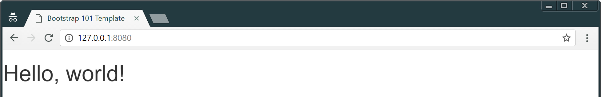
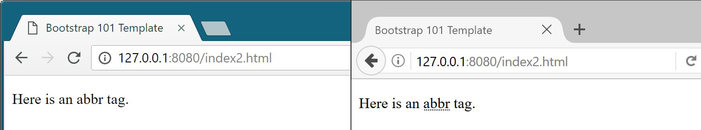
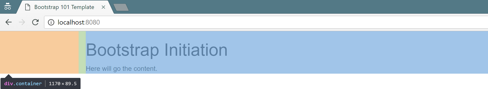
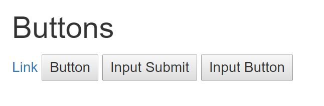
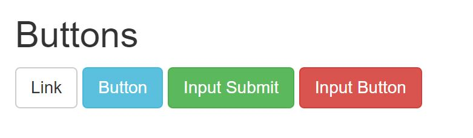
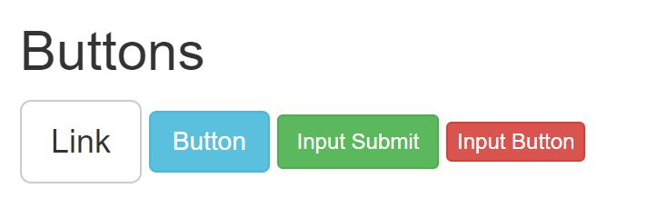
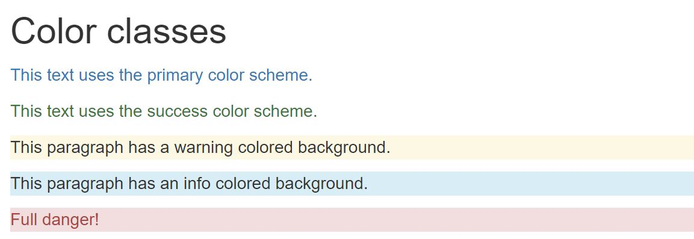

# Bootstrap

<!-- slide-include ../../BANNER.md -->

Introduction to [Bootstrap][bootstrap], a HTML/CSS framework, useful to quickly build HTML templates and views.

**You will need**

* [Google Chrome][chrome] (recommended, any browser with developer tools will do)
* [Sublime Text][sublime] (recommended, any code editor will do... **except Notepad**)

**Recommended reading**

* [Project setup][projset]

<!-- START doctoc generated TOC please keep comment here to allow auto update -->
<!-- DON'T EDIT THIS SECTION, INSTEAD RE-RUN doctoc TO UPDATE -->


- [What is Bootstrap?](#what-is-bootstrap)
- [Why Bootstrap?](#why-bootstrap)
- [Use Bootstrap](#use-bootstrap)
  - [Download locally](#download-locally)
  - [How do I know it's working?](#how-do-i-know-its-working)
- [What does it do?](#what-does-it-do)
- [Bootstrap documentation](#bootstrap-documentation)
  - [Screen-readers helpers](#screen-readers-helpers)
- [Element styles](#element-styles)
  - [Which elements?](#which-elements)
  - [Examples](#examples)
  - [Why put styles on element?](#why-put-styles-on-element)
  - [Normalization](#normalization)
- [New classes](#new-classes)
  - [Start again](#start-again)
  - [Container](#container)
  - [Tables](#tables)
  - [Buttons](#buttons)
  - [Icons](#icons)
  - [Forms](#forms)
  - [Color classes](#color-classes)
- [Components](#components)
  - [Forms... again](#forms-again)
  - [Navbar](#navbar)
  - [Lists](#lists)
- [Panel](#panel)
  - [Panel's content](#panels-content)
  - [Panel's title](#panels-title)
  - [Panel's footer](#panels-footer)
  - [Panel's color](#panels-color)
  - [Expand panel's body](#expand-panels-body)
- [Resources](#resources)

<!-- END doctoc generated TOC please keep comment here to allow auto update -->

## What is Bootstrap?

<!-- slide-front-matter class: center, middle, image-header -->

<p class='center'></p>

> "Bootstrap is the **most popular** HTML, CSS, and JS framework for developing **responsive**, mobile first projects on the web."

## Why Bootstrap?

Bootstrap is a **framework**.

This means it's a set of **pre-defined** "elements", here HTML components and CSS classes, that developers can use to spare them the time and effort of writing these elements from scratch.

Thus, using Bootstrap (or any other HTML/CSS framework) gives you:

* **Speed of development**:
  * Everything is already there for you
* **Consistency**:
  * All your pages will look the same
* **Responsivness**:
  * Bootstrap behave well on desktop, tablet or smartphone
* **Customizability**:
  * Every components can be modified to suit your needs
* **Support**:
  * Bootstrap is heavily used, tested and documented

## Use Bootstrap

Bootstrap is, basically, **one big CSS file**, and as such, **must be included** in your project for you to use it.

You have two main ways to do that, the first one being using a **CDN**.

CDN, that stands for **C**ontent **D**elivering **N**etwork, allows you **to reference files** useful for your project using **URLs** that points to them.

This way, each time a page with a CDN URL is requested by a user, the file is **retrieved through Internet** and stored in the user's computer memory.

To include Bootstrap with a CDN, add this `<link>` tag at the bottom of your `<head>` tag in your `index.html` file:

```html
<head>
  ...
  <link rel="stylesheet" href="https://maxcdn.bootstrapcdn.com/bootstrap/3.3.7/css/bootstrap.min.css" integrity="sha384-BVYiiSIFeK1dGmJRAkycuHAHRg32OmUcww7on3RYdg4Va+PmSTsz/K68vbdEjh4u" crossorigin="anonymous">
</head>
```
> This will include in your site the 3.3.7 version of the minified CSS file

### Download locally

You can also **download the files locally** and reference them in your `index.html` file.

1. Download a `.zip` containing all Bootstrap files [here][dl-bootstrap]
2. Unzip the file somewhere on your filesystem
3. Once unzipped, you should have the following structure:

```sh
bootstrap-3.3.7-dist/
  ├─ css/
  │   └─ [some files]
  ├─ font/
  │   └─ [some files]
  └─ js/
      └─ [some files]
```

Copy the complete `css` and `font` directories and place them at the root of your project directory, then add this `<link>` tag at the bottom of your `<head>` tag in your `index.html` file:

```html
<head>
  ...
  <link href="css/bootstrap.min.css" rel="stylesheet">
</head>
```
### How do I know it's working?

To be sure that Bootstrap is correctly included in your project, just open your `index.html` in a browser.

With a simple "Hello World" example, your page **without Bootstrap** could look like this:

<p class='center'></p>

The same page, but **with Bootstrap correctly included** should look like this:

<p class='center'></p>

> Notice how the font has changed? That's a **good** sign.

## What does it do?

We already said that Bootstrap is a bunch of CSS styles already written for you.

Those styles could be divided in three categories:

* **Element styles**: overwrite the default style for some HTML elements
* **New classes**: new CSS classes (obviously) that can be used when needed
* **Components**: a set of classes that needs to be used with a **strictly defined** HTML structure.

This slide-deck will present you this three categories, and how to use some interesting styles in each one.

## Bootstrap documentation

Everything that is presented in this slide-deck can also be found in **the very well done Bootstrap documentation**, along with lot of **examples** and **information**.

We highly recommend that you check it out.

[Bootstrap Documentation][bootstrap-css]

<!-- slide-front-matter class: center, middle -->

### Screen-readers helpers

When browswing the Bootstrap documentation, you'll inevitably found some examples with `.aria-*` attributes:

```html
<button type="button" class="close" `aria-label`="Close">
  <span `aria-hidden`="true">&times;</span>
</button>
```
You could also find elements with the `.sr-only` class or the `role` attribute:

```html
<span `class="sr-only"` `role="error"`>Error:</span>
```
All these [ARIA][aria] attribute, class or `role` are used only for **accessibility**.

They are invisible to human reader and only interpreted by assistive technologies or software that help disabled people browsing the Web.

> They **don't alter** in any ways neither **the design of the page** nor **the behavior of its elements**.
> 
> **Remove them without fear for your design**, if you don't want them polluting your HTML.

## Element styles

<!-- slide-front-matter class: center, middle -->

### Which elements?

Bootstrap comes with CSS styles that are applied to **HTML elements**, without **adding classes** to said elements.

Some of the elements that are impacted are:

* `<h1>` to `<h6>`
* `<small>` (an element that display smaller text)
* `<mark>` (an element that highlights its content)
* `<abbr>` (an element to explain an abbreviation)
* `<code>` (an element that define its content as code)

> More information in the [Bootstrap documentation][bootstrap-css]

### Examples

To see for yourself how Bootstrap stylizes those elements, let's **add some of them** in your project.

Open the `index.html` file and **replace** the content between the `body` tags with this:

```html
<h1>This is a h1 Title <small>with small text inside</small></h1>
<h2>This is a h2 Title</h2>
<p>This is a paragraph <small>with small text inside</small></p>
<p><mark>Some highlight text.</mark></p>
<p>Here is an <abbr title="abbreviation">abbr</abbr> tag.</p>
<p>Do you want to write some <code>function()</code>?</p>
```

To **compare** the same elements without Bootstrap, create a new file called `compare.html`, and **copy-paste all the content** of `index.html` inside it.

Now, in the `compare.html` file, **remove** the line with the `<link>` that **includes** Bootstrap, and save it.

Finally, open both `index.html` and `compare.html` in your browser.

> What differences do you see?

### Why put styles on element?

As you can see, HTML elements already **have** default styles, even without CSS.

But these styles are **browser dependant**, i.e. your page could be rendered differently on **Chrome**, **Firefox**, **Edge** and/or **Safari**.

See, for example, the rendering of an `<abbr>` tag on **Chrome** VS **Firefox**...

<p class='center'></p>

...or that of a `<code>` tag on **Chrome** VS **Edge**

<p class='center'></p>

### Normalization

To avoid this rendering problem, developers use a technique called **CSS Normalization**.

Normalizing the CSS means creating styles for **HTML element** to **cancel** default styles that are **not consistent among browsers**.

Bootstrap uses the [Normalize.css][normalize] library, that do just that.

By using a normalizer and adding its own style for basic HTML elements, Bootstrap ensures that your page will be **consistently rendered** on each browser.

## New classes

<!-- slide-front-matter class: center, middle -->

### Start again

Bootstrap also comes with a **ton of new classes** that can be applied to HTML elements.

Some of these classes need to be applied to **specific elements**, while others can be applied to **almost any element**.

To try this, let's start anew with our `index.html` file.

Delete everything that's between your `<body>` tag and add:

```html
<div>
  <h1>Bootstrap Initiation</h1>
  <div>Here will go the content.</div>
</div>
```

### Container

Containers represents the `<div>`s that **structure** your content.

Right now, this content is **fully aligned to the left** of the screen, almost touching the edge. It's ugly and not very readable.

You can change that by adding a `.container-fluid` class to a `<div>`.

```html
<div `class='container-fluid'`>
  <h1>Bootstrap Initiation</h1>
  <div>Here will go the content.</div>
</div>
```
> The content will have a padding of `15px` from both edges, and your container will be as wide as possible.

#### `.container`

If you want your container to be more centered, use the `.container` instead.

```html
<div `class='container'`>
  <h1>Bootstrap Initiation</h1>
  <div>Here will go the content.</div>
</div>
```
> Your container is now more centered on the screen.

<!-- slide-notes -->

The `.container` class is designed so that your `<div>` will always be, at maximum, the width of a **1024x768** screen resolution, but with a padding of `15px`.

#### Illustration

<p class='center'></p>

<p class='center'></p>

<p class='center'></p>

### Tables

<!-- slide-column -->

Manually styling tables in CSS can be quite painful and time consuming.

Bootstrap provides you with the `.table` class, that must be added to a `<table>` tag.

Replace this line...

```html
<div>Here will go the content.</div>
```
...by this line...

```html
<h2>Tables</h2>
```
... then add the following snippet:

<!-- slide-column -->

```html
<table `class="table"`>
  <thead>
    <th>#</th>
    <th>First name</th>
    <th>Last name</th>
    <th>Starship</th>
  </thead>
  <tbody>
    <tr>
      <td>1</td>
      <td>Jean-Luc</td>
      <td>Picard</td>
      <td>Enterprise D</td>
    </tr>
    <tr>
      <td>2</td>
      <td>Benjamin</td>
      <td>Sisko</td>
      <td>Defiant</td>
    </tr>
    <tr>
      <td>3</td>
      <td>Kathryn</td>
      <td>Janeway</td>
      <td>Voyager</td>
    </tr>
  </tbody>
</table>
```
#### More table classes

> These classes **must be** used in addition of the `.table` class.

To add **stripes**, add the `.table-striped` class to your `<table>`:

```html
<table `class`="table `table-striped`">
```
To add **border**, add the `.table-bordered` class to your `<table>`:

```html
<table `class`="table `table-bordered`">
```
To add a **hover effect** to table rows, add the `.table-hover` class:

```html
<table `class`="table `table-hover`">
```
> You can use more than one additional class to your `<table>`.

For example, if you'd want to have a table that has **all the preceding styles** at the same time, you could use:

```html
<table `class="table table-bordered table-striped table-hover"`>
```

### Buttons

Bootstrap adds many new classes regarding buttons, that allows you to create a wide variety of possible usage.

Let's add some buttons to the `index.html` page. Add the following snippet right before the `<h2>Tables</h2>` element:

```html
<h2>Buttons</h2>
<div>
  <a href="#">Link</a>
  <button>Button</button>
  <input type="submit" value="Input Submit">
  <input type="button" value="Input Button">
</div>
```
> Right now, this should give you this:

<p class="shadow"></p>

> It's doesn't look like much. Let's remedy that.

#### The `.btn` class

To properly use any of the button styles, you **must** add the special class `.btn` to the element you want to sylize.

> You can add a button style to any `<a>`, `<button>` or `<input>` elements.

```html
<a href="#" `class='btn'`>Link</a>
<button `class='btn'`>Button</button>
<input type="submit" value="Input Submit" `class='btn'`>
<input type="button" value="Input Button" `class='btn'`>
```
The result should be:

<p class="shadow"></p>

The `.btn` class is used to add to the element all the styles that are **common** among all button styles.

> Each of the additionnal button class will add the styles that are specific to the style.

#### Additionnal classes

Bootstrap defines **seven button styles**, each with its own class to add to an element **that already have** the `.btn` class:

| Style   | CSS class      | Result |
| :------ | :------------- | :----- |
| Default | `.btn-default` | <button class="btn btn-default">Click me!</button> |
| Primary | `.btn-primary` | <button class="btn btn-primary">Click me!</button> |
| Success | `.btn-success` | <button class="btn btn-success">Click me!</button> |
| Info    | `.btn-info`    | <button class="btn btn-info">Click me!</button> |
| Warning | `.btn-warning` | <button class="btn btn-warning">Click me!</button> |
| Danger  | `.btn-danger`  | <button class="btn btn-danger">Click me!</button> |
| Link    | `.btn-link`    | <button class="btn btn-link">Click me!</button> |

#### Try it!

Add a:

* `.btn-default` class to the `<a>` element
* `.btn-info` class to the `<button>` element
* `.btn-success` class to the `<input type="submit">` element
* `.btn-danger` class to the `<input type="button">` element

----

The result should look like this:

<p class="shadow"></p>

#### Size control

You can also change the overall size of your button, using three additionnal classes.

Add the `.btn-lg` class to the `<a>` element to see it **larger**:
```html
<a href="#" `class`="btn btn-default `btn-lg`">Link</a>
```

Add the `.btn-sm` class to the `<input type="submit">` element to see it **a bit smaller**:
```html
<input type="submit" value='Input Submit' `class`="btn btn-success `btn-sm`">
```

Add the `.btn-xs` class to the `<input type="button">` element to see it **extra smaller**:
```html
<input type="button" value='Input Button' `class`="btn btn-danger `btn-xs`">
```

<p class="shadow"></p>

### Icons

Bootstrap uses the Glyphicons font, that provides you with [over 250 icons][bootstrap-glyphicons] to use in your design.

To use these icons, just add an empty `<span>` element with `.glyphcion` class **plus the class for the icon you want**.

Add this before the `<h2>Buttons</h2>` element:

```html
<h2>Icons</h2>
<div>
  <button class="btn btn-default">
    <span class="`glyphicon` `glyphicon-align-left`"></span>
  </button>
  <button class="btn btn-default">
    <span class="`glyphicon` `glyphicon-align-center`"></span>
  </button>
  <button class="btn btn-default">
    <span class="`glyphicon` `glyphicon-align-right`"></span>
  </button>
</div>
```

> Never put anything between the `<span>` tags, and always use the `.glyphicon` classes on `<span>` elements only.

### Forms

Creating forms in HTML is a big part of constructing website or webapplication, and this is yet another subject that Bootstrap can handle for you.

Add these lines right before the `<h2>Icons</h2>` element:

```html
<h2>Forms</h2>
<form>
  <input type="submit" class="btn btn-success">
</form>
```
> We'll build more in this `<form>` element in the following slides.

#### `.form-control`

Add the `.form-control` class to an `<input>` element to make it **full-width and stylized**.

> This class can be added to any type of input.

Let's add an text input that's to receive the **username** of an hypothetic sign up form.

Add these lines at the beginning of the `<form>` element:

```html
<label for="username">Username</label>
<input type="text" id="username" `class="form-control"`>
```
> The input is correctly displayed, but there's a spacing problem with the following button.

#### `.form-group`

To resolve any spacing problem that could be present in your form, be sure to wrap your form element in a `<div>` with the `.form-group` class.

> Do this with the preceding **username** input **and** label.

Let's complete our form by adding a password input that's to receive the **password** of our new user.

Add these lines before the `<input type="submit">`:

```html
*<div class="form-group">
  <label for="password">Password</label>
  <input type="password" id="password" class="form-control">
*</div>
```

> Notice how the `<label>` **and** the `<input>` are grouped together inside the `div.form-group` element.

#### `.form-inline`

By default, all elements with the `.form-control` class will be as wide as possible, and will be presented in a stack, i.e. one element in top of another.

If you'd rather prefer to have you form displayed inline, juste add the `.form-inline` class to your top `<form>` element.

```html
<form `class="form-inline"`>
  <div class="form-group">
    <label for="username">Username</label>
    <input type="text" id="username" class="form-control">
  </div>
  <div class="form-group">
    <label for="password">Password</label>
    <input type="password" id="password" class="form-control">
  </div>
  <input type="submit" class="btn btn-success">
</form>
```
> The `<label>` are optional. You could delete them and use the `placeholder` attribute  on `<input>` instead.
```html
<div class="form-group">
  <input type="password" id="..." class="..." `placeholder="Password"`>
</div>
```
<!-- slide-notes -->
Be aware that not all forms can be put inline. If your form is too big, it won't render correctly.

### Color classes

Remember the button styles (*Primary*, *Success*, *Info*, *Warning* and *Danger*)?

You can use these same color style on almost any element in your page, wether it be on the text or on the background.

> Using this classes along with other pre-defined Bootstrap classes could have no effect.

Add this before the `<h2>Forms</h2>` element:

```html
<h2>Color classes</h2>
<p class="`text-primary`">This text uses the primary color scheme.</p>
<p class="`text-success`">This text uses the success color scheme.</p>
<p class="`bg-warning`">This paragraph has a warning colored background.</p>
<p class="`bg-info`">This paragraph has an info colored background.</p>
<p class="`bg-danger` `text-danger`">Full danger!</p>
```

<p class='shadow'></p>

## Components

Components are specific HTML structure used on combination with specific classes.

This allows more advances behavior and design.

<!-- slide-front-matter class: center, middle -->

### Forms... again

There's two components that are related to forms, that we didn't see before:
* Checkboxes
* Radio buttons

Both these components need **specific HTML markup** to function correctly in Bootstrap forms. In both case, the markup is **similar**:

<!-- slide-column -->

**Checkbox**

```html
<div class="checkbox">
  <label>
    <input type="checkbox">
    Remember me
  </label>
</div>
``` 

<!-- slide-column -->

**Radio button**

```html
<div class="radio">
  <label>
    <input type="radio" name="gender">
    Female
  </label>
</div>
```

<!-- slide-container -->

> With this markup, checkboxes and radio button **spacing is optimal**, and clicking on the label is considered **clicking on the checkbox or radio button**.

<!-- slide-notes -->

Let's update our first form by adding a checkbox and some radio buttons:

```html
<h2>Forms</h2>
<form>
  <!-- other form elements -->
* <div class="checkbox">
    <label>
      <input type="checkbox" name="remember" id="remember">
      Remember me!
    </label>
  </div>
* <div class="radio">
    <label>
      <input type="radio" name="gender" id="male" value="male">
      Male
    </label>
  </div>
* <div class="radio">
    <label>
      <input type="radio" name="gender" id="female" value="female">
      Female
    </label>
  </div>
  <input type="submit" name="send" class="btn btn-success">
</form>
```

### Navbar

To create a navigation bar in your WebSite, you can use the **navbar** component.

Add these lines right after your opening `<body>` tag:

```html
<nav class="navbar navbar-default">
</nav>
```
> The `.navbar-default` class has an effect on the style of the navbar. You could replace it by the `.navbar-inverse` class for a dark navbar.

This code adds a blank navbar, that takes up all the screen space available.

> If you'd prefer a navbar that is as wide as the main content, simply move the code inside the `<div class="container">`.

#### Navbar content

Let's move our main title from the content of the page to the content of the navbar.

Delete the `<h1>` from your code, and add its text inside the `<nav>` tag:

```html
<nav class="navbar navbar-default">
  Bootstrap Initiation
</nav>
```
> See how the text is stuck on the upper-left corner?
> 
> The **navbar** component needs a container to properly space its content.

Wrap the text inside the navbar with a `<div>` having the `.container` or `.container-fluid` class, as you see fit:

```html
<nav class="navbar navbar-default">
* <div class='container'>
    Bootstrap Initiation
* </div>
</nav>
```

#### Navbar Brand

Usually, the navbar is where the logo or the brand of the WebSite is placed.

For us, "Bootstrap Initiation" could be seen as the brand of our page.

To tell the navbar what element is the brand, use the `.navbar-brand` class on an `<a>` element:

```html
<div class='container'>
  <a class="`navbar-brand`" href="#">Bootstrap Initiation</a>
</div>
```
> Making the brand element a link to the homepage is a good practice, hence the use of an `<a>` element here.

This will fit our title nicely inside the Navbar.

#### Fixed navbar

If you scroll in your `index.html` page, you'll see that the navbar **scrolls with it**, thus disappearing from the screen at one point.

You may want to have a navbar that's **constantly fixed** to the top of the screen.

To do this, add the `.navbar-fixed-top` class to your `<navbar>` element.

> Using the `.navbar-fixed-bottom` class allows you to create footer.

```html
<nav class="navbar navbar-default `navbar-fixed-top`">
  <!-- navbar content -->
</nav>
```
But, damn!, now our navbar **overlaps** our content...

> Since the navbar is now a fixed element, it **doesn't take space** anymore in the page flow. So all other content are **moved back up**.

To fix this, we need to **add some padding** to the element that encloses our content.

#### Fix the fixed navbar

Let's change our content element from a `<div>` to a `<main>`:

```html
<body>
  <nav class="navbar navbar-default navbar-fixed-top">
    <!-- navbar content -->
  </nav>
* <main class="container">
    <!-- main content -->
* </main>
</body>
```
To add it padding, we need to define a custom style.

1. In your project directory, create a `css` directory if it doesn't exist yet
2. In this `css` directory, create a new `style.css`, and open it
3. Add this line, and save the file:
```css
main { padding: 60px; }
```

1. Include the new CSS file in your `index.html`, between the `<head>` tags:
```html
<link rel="stylesheet" type="text/css" href="css/style.css">
```

#### Navbar links

As its name implies, the navbar is usually ideal for navigation.

To add links inside your navbar, you need to use an `<ul>` element with the `.nav` and `.navbar-nav` classes.

> The `<li>`s inside this `<ul>` doesn't need any particulier class.

In our case, the navigation could be going to the `compare.html` page (*assuming you still have it*).

Let's add this right after our `<a class="navbar-brand">` element:

```html
<ul class="nav navbar-nav">
  <li><a href="compare.html">Compare</a></li>
</ul>
```

#### Navbar buttons

Now, let's say we'd like a kind of *button* in our navbar that scrolls up to the top of the page.

Simply adding a *button* to the navbar will not quite do the trick:

```html
<nav class="navbar navbar-default navbar-fixed-top">
  <div class='container'>
    <a class="navbar-brand">Bootstrap Initiation</a>
    <ul class="nav navbar-nav">
      <li><a href="compare.html">Compare</a></li>
    </ul>
*   <a class="btn btn-default" href="#">Go to top</a>   
  </div>
</nav>
```
> This button will be stuck to the top of the navbar.

To add proper spacing, you need to add the `.navbar-btn` class:

```html
...
    <a class="btn btn-default `navbar-btn`" href="#">Go to top</a>   
...
```

#### Navbar alignment

Finally, we would like this *button* to be aligned to the far right of the bar.

There's two classes to use when you want to align things in your navbar:

* `.navbar-left` will align elements to the left of the navbar
* `.navbar-right` will align elements to the right of the navbar

> However, due to a [bug in Bootstrap's v3 navbar][bug-nav], you can't just use it on the button.

> Doing so will result in **an error in the left margin**.

To add proper positionning:

1. Wrap your content around a new `<div>` with a `.collapse` and `.navbar-collapse` classes
2. Add the `.navbar-right` to the `<div>`

```html
...
  <div class="`collapse navbar-collapse` `navbar-right`">
    <a class="btn btn-link navbar-btn" href="#">Go to top</a>
  </div>   
...
```

### Lists

As we said before, simple lists using the classics `<ul>` and `<li>` elements without any classes are already stylized by Bootstrap.

However, the framework also supports more advanced list options.

To create a "stack-style" list, add :
* a `.list-group` class to the `<ul>` element
* a `.list-group-item` to the `<li>` elements.

Add this code right before the `<h2>Color classes<h2>` element:
```html
<h2>Lists</h2>
<ul class="`list-group`">
  <li class="`list-group-item`">The Original Series</li>
  <li class="`list-group-item`">The Next Generation</li>
  <li class="`list-group-item`">Deep Space Nine</li>
  <li class="`list-group-item`">Voyager</li>
  <li class="`list-group-item`">Enterprise</li>
  <li class="`list-group-item`">Discovery</li>
</ul>
```

#### Badges

If you think about social applications like Whatsapp or ToDo applications like Wunderlist, you probably remember little numbers (called **badges**) at the right-end of a list element:

<p class='center'></p>

You can add them in your list (or anywhere) by adding a `<span>` element with the `.badge` class:

```html
<li class="list-group-item">The Original Series `<span class="badge">3</span>`</li>
<li class="list-group-item">The Next Generation `<span class="badge">7</span>`</li>
<li class="list-group-item">Deep Space Nine `<span class="badge">7</span>`/li>
<li class="list-group-item">Voyager `<span class="badge">7</span>`</li>
<li class="list-group-item">Enterprise `<span class="badge">4</span>`</li>
<li class="list-group-item">Discovery `<span class="badge"></span>`</li>
```
> Notice how the last one **doesn't show up**? That's because empty badges will be automatically hidden from the view.

#### Link elements

If you'd like your list elements to be links, you need to tweek a little your HTML structure:
* the `<ul>` become a `<div>`
* the `<li>`s become `<a>`s

```html
<`div` class="list-group">
  <`a` class="list-group-item"><!-- content --></`a`>
  <`a` class="list-group-item"><!-- content --></`a`>
  <`a` class="list-group-item"><!-- content --></`a`>
  <`a` class="list-group-item"><!-- content --></`a`>
  <`a` class="list-group-item"><!-- content --></`a`>
  <`a` class="list-group-item"><!-- content --></`a`>
</`div`>
```
> The classes stay the same.

You can now add a `href` attribute to any list item:

```html
<a class="list-group-item" `href="https://en.wikipedia.org/wiki/Star_Trek:_The_Original_Series" `>The Original Series <span class="badge">3</span></a>
```

#### I want more!

Just putting a single line of text inside a list item is sometimes not enough.

Again, think of any instant messaging app on smartphone/tablet or desktop, where you could have, in each list item:
* The name of your contact
* Its profile picture
* The last exchanged message
* The date at which this last message was exchange
* etc

Let's create a second list right below the `<h2>Lists</h2>` element:

```html
<div class="list-group">
  <a class="list-group-item"></a>
  <a class="list-group-item"></a>
  <a class="list-group-item"></a>
</div>
```

#### Custom list item

You can add some HTML elements within the `<a>` list-items to enrich them.

Add a title by using the `.list-group-item-heading` class on an element:

```html
<a class="list-group-item">
* <h4 class="list-group-item-heading">James T. Kirk</h4>
</a>
```
Add some text by using the `.list-group-item-text` class on a `<p>`:

```html
<a class="list-group-item">
  <h4 class="list-group-item-heading">James T. Kirk</h4>
* <p class="list-group-item-text">Beam me up, Scotty!</p>
</a>
```
> Custom list item can also be used with `<li>` elements.

You are free to add almost any kind of custom HTML inside a list item.

> You'll obvisouly need to add some custom CSS to this custom HTML.

#### Contextual list item colors

Any element within a `.list-group` list can be added one of the [Bootstrap color classes](./#32).

> But using the `.text-*` or the `.bg-*` classes won't work here!

Use a `.list-group-item-*` class for the color to properly apply:

```html
<div class="list-group">
  <a class="list-group-item list-group-item-success"><!-- content --></a>
  <a class="list-group-item list-group-item-info"><!-- content --></a>
  <a class="list-group-item list-group-item-danger"><!-- content --></a>
</div>
```
> As a reminder, here are the color suffixes available:
> * `primary` (strong navy blue)
> * `success` (pale green)
> * `info` (pale sky blue)
> * `warning` (pale orange)
> * `danger` (pale red)

## Panel

Panels are component designed for structuring content, and as such appear as visible blocks on the page (think Facebook's statuses).

To create a panel, the markup is quite simple: just create a `<div>` with the `.panel` class (and the `.panel-default` class for now).

Put this right before the `<h2>Lists</h2>?`:

```html
<h2>Panels</h2>
<div class="`panel panel-default`">
  Today, I ate an apple. It was tasty
</div>
```
> You see that the content is placed inside some kind of round-cornered block.

> But the spacing is quite not right...

### Panel's content

For correct spacing, the content of a panel **must be** placed inside a `<div>` with the `.panel-body` class:

```html
<div class="panel panel-default">
  <div class="`panel-body`">
    Today, I ate an apple. It was tasty
  </div>
</div>
```
> You can see that the title is highlighted by a different color than the content.

### Panel's title

Panels being block of content, you might want to indicate what is its actual content.

For doing so, you can use a **panel heading**.

Create a new `<div>` witht the `.panel-heading` class, and place your text inside:

> The new `div.panel-heading` must be placed before the `div.panel-body`.

```html
<div class="panel panel-default">
* <div class="panel-heading">
*   John Doe commented on that:
* </div>
  <div class="panel-body">
    Today, I ate an apple. It was tasty
  </div>
</div>
```
### Panel's footer

With certain use-case, you could want a special zone at the bottom of your panel to put, for example, action button or less important information.

To do that, add after the `div.panel-body` a new `<div>` with the `.panel-footer` class:

```html
<div class="panel panel-default">
  <div class="panel-heading">
    John Doe commented on that:
  </div>
  <div class="panel-body">
    Today, I ate an apple. It was tasty
  </div>
* <div class="panel-footer">
*   <button class="btn btn-default">
*    <span class="glyphicon glyphicon-thumbs-up"></span> Like
*   </button>
*   <button class="btn btn-default">
*     <span class="glyphicon glyphicon-pencil"></span> Comment
*   </button>
*   <button class="btn btn-default">
*    <span class="glyphicon glyphicon-share"></span> Share
*   </button>
* </div>
</div>
```
### Panel's color

One more time, Bootstrap allows you to add color to your component, using the same color schemes than usual.

Replace the `.panel-default` with one of the available classes to use these color schemes:

* `.panel-default`
* `.panel-primary`
* `.panel-success`
* `.panel-info`
* `.panel-warning`
* `.panel-danger`


```html
<div class="panel `panel-info`">
  <!-- panel-content -->
</div>
```
> Note that this will only change the color of **the title and the border**. The footer will stay grey-ish.

### Expand panel's body

Adding a **table** or a **list group** inside a panel render it in a seamless fashion, perfectly intergrating this table or list group to the panel's design.

Simply add a `<table>` with the `.table` class **after** your `div.panel-body`:

```html
<div class="panel panel-default">
  <div class="panel-heading">
    John Doe commented on that:
  </div>
  <div class="panel-body">
    Today, I ate an apple. It was tasty
  </div>
* <table class="table">
*   <thead>
*     <tr><th>First Name</th><th>Last Name</th></tr>
*   </thead>
*   <tbody>
*     <tr><td>Mark</td><td>Otto</td></tr>
*     <tr><td>Jacob</td><td>Thornton</td></tr>
*     <tr><td>Larry</td><td>the Bird</td></tr>
*   </tbody>
* </table>
  <div class="panel-footer">
    <!-- foter-content -->
  </div>
</div>
```

#### List group in body

For a list group, its the same idea.

> Remove the table from the panel.

Add your new `<ul>` witht the `.list-group` class directly after the `div.panel-body`:

```html
<div class="panel panel-default">
  <div class="panel-heading">
    John Doe commented on that:
  </div>
  <div class="panel-body">
    Today, I ate an apple. It was tasty
  </div>
* <div class="list-group">
*   <a class="list-group-item">Golden</a>
*   <a class="list-group-item">Grany</a>
*   <a class="list-group-item">Williams</a>
* </div>
  <div class="panel-footer">
    <!-- foter-content -->
  </div>
</div>
```

## Resources

You will find the final HTML file for this course [here][final-file].

**Documentation**

* [Bootstrap CSS Documentation][bootstrap-css]
* [Normalize CSS][normalize]

**Further reading**

* [Bootstrap - Layout management][bsm]

[sublime]: https://www.sublimetext.com/
[bootstrap-css]: http://getbootstrap.com/css/
[chrome]: https://www.google.com/chrome/
[rtfm]: https://en.wikipedia.org/wiki/RTFM
[bootstrap]: http://getbootstrap.com/
[dl-bootstrap]: https://github.com/twbs/bootstrap/releases/download/v3.3.7/bootstrap-3.3.7-dist.zip
[normalize]: https://necolas.github.io/normalize.css/
[bootstrap-glyphicons]: http://getbootstrap.com/components/#glyphicons-glyphs
[final-file]: https://gist.githubusercontent.com/Tazaf/18732ef01164f7b6348443c4c4748f42/raw/9f1dec778546a4d9741f1d17b08212c5606c26ca/index.html
[bsm]: ../bootstrap-layout-management
[projset]: ../masrad-project-setup
[aria]: https://developer.mozilla.org/en-US/docs/Web/Accessibility/ARIA
[bug-nav]: https://github.com/twbs/bootstrap/issues/17598#issuecomment-160248326