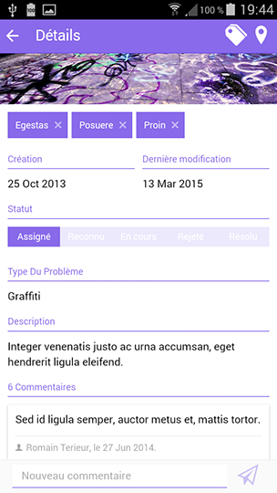
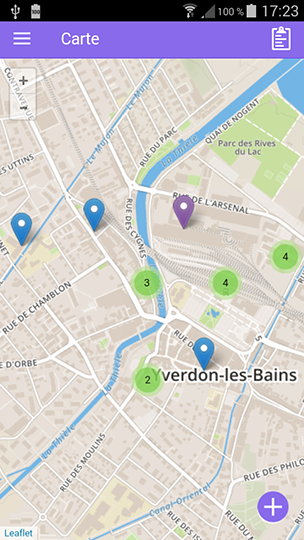
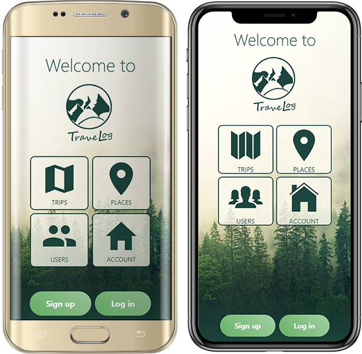
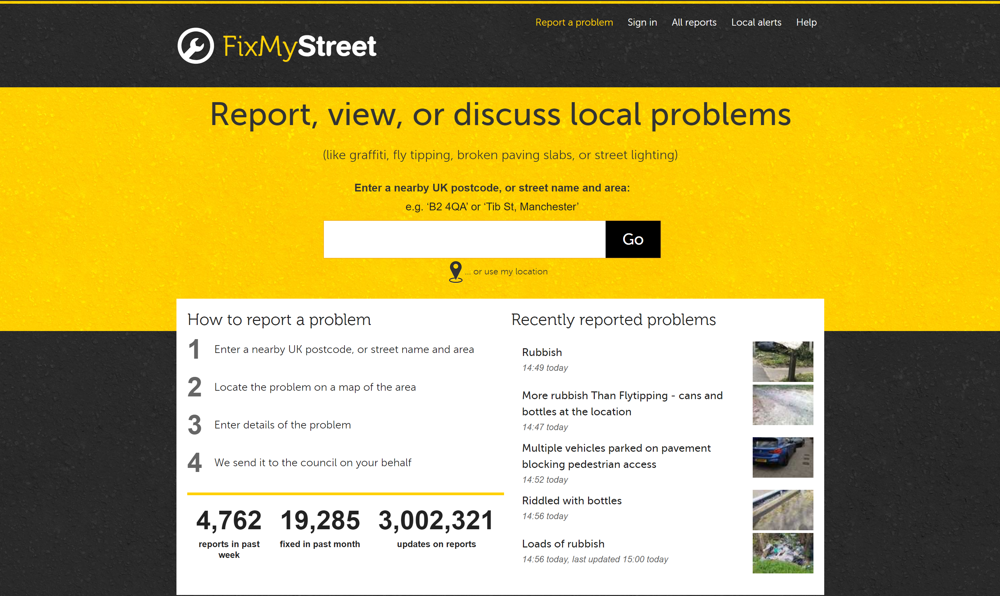
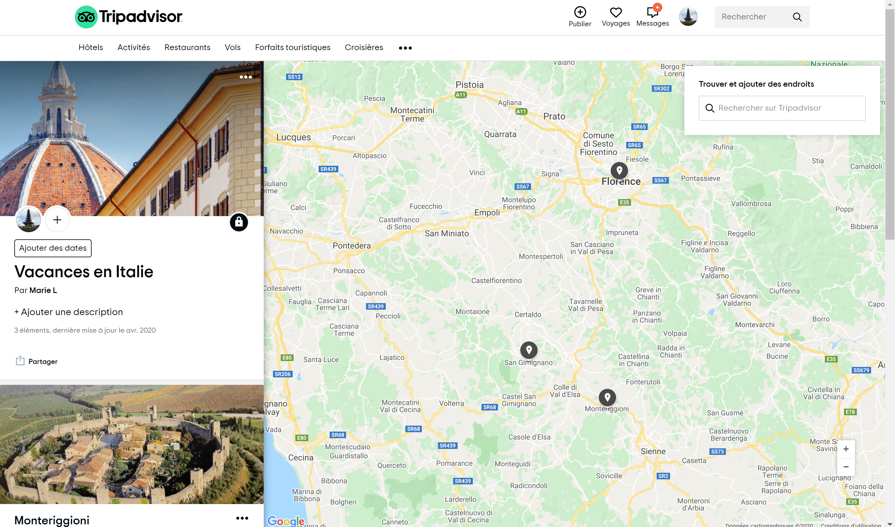

<!-- START doctoc generated TOC please keep comment here to allow auto update -->
<!-- DON'T EDIT THIS SECTION, INSTEAD RE-RUN doctoc TO UPDATE -->

- [MAS-RAD -- Advanced Front-end Development (DFA)](#mas-rad----advanced-front-end-development-dfa)
  - [Citizen engagement](#citizen-engagement)
  - [Report a problem](#report-a-problem)
  - [Front-end](#front-end)
  - [Back-end](#back-end)
  - [Features requirements](#features-requirements)
  - [Implementation requirements](#implementation-requirements)
  - [Delivery](#delivery)

<!-- END doctoc generated TOC please keep comment here to allow auto update -->

# MAS-RAD -- Advanced Front-end Development (DFA)

The goal of this course is to discover concepts and tools to organize the front-end side of a web application and enrich the user interface/experience according to current good practices. You will:

- learn how to make good use of a CSS framework to build a responsive HTML user interface
- learn (or review) how to manipulate the DOM API with or without a library
- learn how to manage asynchronous communications with a Web API on the back end
- learn how the use of a framework does help to organize the front-end code of a single page application
- be introduced to frameworks that help you develop and build your web application for multiple devices

Everything starts from here: [https://github.com/MediaComem/comem-masrad-dfa](https://github.com/MediaComem/comem-masrad-dfa)

## Course deliverable

The final deliverable of this course is a complete web application for one of these subjects:

| _App Name_             | _Pitch_                                                                      |
| :--------------------- | :--------------------------------------------------------------------------- |
| **Citizen Engagement** | Allow citizens to report problems encountered in the streets of a city       |
| **Travel Log**         | Allow users to publish logs of their travels around the world to other users |

> you'll have to chose individually which one you want to implement later

## Front end

In this course, the focus is on the front-end side of the web application, building a rich user interface and experience.

<!-- slide-column -->

**Citizen Engagement example**

  
  

<!-- slide-column -->

**Travel Log example**

## Back-end

Your web application will make use of a REST web service backend that is already implemented and ready to be used.

| _App Subject_          | _Link_                                                                          |
| ---------------------- | ------------------------------------------------------------------------------- |
| **Citizen Engagement** | [API Documentation](https://mediacomem.github.io/comem-citizen-engagement-api/) |
| **Travel Log**         | [API Documentation](https://comem-travel-log-api.herokuapp.com/)                |

> We'll see later on this course how to call and exploit those APIs

  

## Application subjects

<!-- slide-front-matter class: center, middle -->

> Let's see what each application subject is about and their different requirements

### Citizen Engagement

This idea is inspired from the UK [FixMyStreet platform](https://www.fixmystreet.com/) you may know.

#### Report a problem

This platform allows UK citizens to report issues in their cities. There are multiple types of issues to report, going from potholes in the street, to electrical defaults or graffitis.

Each issue has a status that is updated when actions are taken by staff members to fix it.

#### Features requirements

In your case, a Citizen Engagement application must allow citizens to:

- **register a new account** and **log in/out** to the app
- **report an issue** at a specific location, with a description, a type, one or more pictures and optional tags
- **manage the issues they reported** (update, delete)
- **see issues on a map** of the area and **see the details** of those issues
- **filter issues** so as to see only some of them (on the map and/or in other screens)
- **search issues** (on the map and/or in other screens)
- **post comments** on issues and **see comments** for an issue somewhere in the app

> To better get what is expected, just [watch this video](https://www.youtube.com/watch?v=wki0t178x2k&feature=youtu.be).

- _Bonus - Staff member features_:
  - log in to the app, update issues' status, and close or reject them
  - see comments on issues and post new comments
  - add, edit and remove issue types from the app

### Travel Log

This idea is somewhat inspired by the [Trip feature of TripAdvisor](https://fr.tripadvisor.ch/Trips/).

#### Create a Trip

This feature of TripAdvisor allows users to create trips (either to plan future trips or make a log during the trip), and add places to them.

Each trip as a description, a cover photo and each place of a trip can be commented by other users.

#### Features requirements

In your case, a Travel Log application must allow users to:

- **register a new account** and **log in/out** to the app
- **create a trip** with a title and a description
- **add places to a trip** at a specific location, with a title, description and picture
- **manages their created trips/places** (update/delete)
- **see a list of trips** and **access the details of a trip**, including the list of its places
- **see places on a map** for one or all trips and **see the details** of those places
- **filter places and/or trips** so as to see only some of them somewhere in the app
- **search places and/or trips** somewhere in the app
- **post comments** on places and **see comments** for them somewhere in the app

## Implementation requirements

Whichever's the subject you'll choose, your app must:

- follow Angular best practices
- use at least the API related to your subject
- correctly handle asynchronous operations (callbacks, promises or observables)
- use HTML5 Geolocation API (e.g. to automatically center the map or place an issue/place on the map)
- use Mapbox (or an equivalent map library) to display a map and stuff on it

> You're free to add features to your app that are not listed on this slidedoc.
>
> They could add some bonus points to your grade, provided that they are correctly implemented and functionnal.
>
> Be advised that stuffing your app with a load of additionnal features without implementing the required ones is not a very good idea...

## Delivery

Each person or group must send an e-mail **no later than July 9th 2020** to [Mathias Oberson](mailto:mathias@squareservice.ch) with

- either the link to your Git source code repository (e.g. on GitHub) - this is the preferred method - or with an archive of your source code (don't forget to comment it!)
- only what is required to make your app run
- a documentation (e.g. README file) that presents your approach, the organization of your solution and optionally some information to know how to make it run
