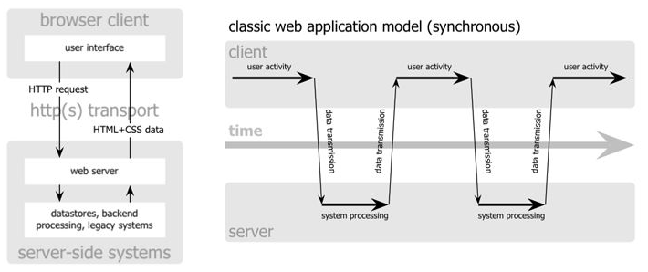
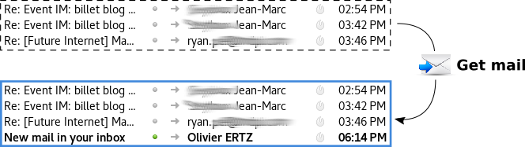
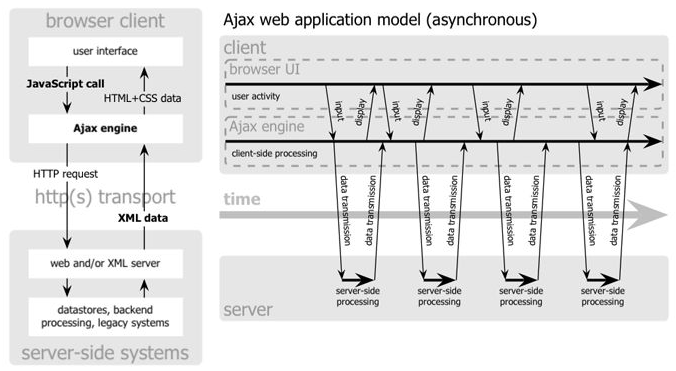
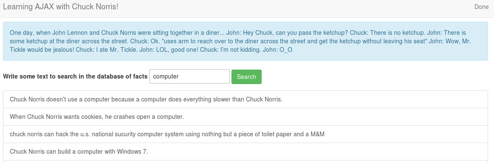

# Asynchronous browser/server interaction

<!-- slide-include ../../BANNER.md -->

We will talk about a technology called **AJAX (Asynchronous JavaScript and XML)** which allows in some ways to improve the user interface behaviour with a good effect on the user experience.

**You will need**

* [Google Chrome][chrome] (recommended, any browser with developer tools will do)
* [Sublime Text][sublime] (recommended, any code editor will do... **except Notepad**)

**Recommended reading**

* [Project setup][projset]
* [Bootstrap][bootstrap]
* [JavaScript][js-bas]
* [DOM API][js-dom]
* [jQuery basics][jq-dom]

<!-- START doctoc generated TOC please keep comment here to allow auto update -->
<!-- DON'T EDIT THIS SECTION, INSTEAD RE-RUN doctoc TO UPDATE -->


- [AJAX technology](#ajax-technology)
- [Classic model](#classic-model)
- [Asynchronous model](#asynchronous-model)
- [Starting file](#starting-file)
- [Dynamic Script Loading](#dynamic-script-loading)
- [Dynamic Script Loading](#dynamic-script-loading-1)
- [Web service, web resource, URL, HTTP GET, POST, ...](#web-service-web-resource-url-http-get-post-)
- [Web resource `getWeatherIcaoHTML`](#web-resource-getweathericaohtml)
- [Callback function declaration](#callback-function-declaration)
- [Web resource `getWeatherIcaoJSONP`](#web-resource-getweathericaojsonp)
- [Create the HTML user interface](#create-the-html-user-interface)
- [Web resource `getWeatherIcaoJSON`](#web-resource-getweathericaojson)
- [Callback function listener](#callback-function-listener)
- [Using jQuery to AJAX](#using-jquery-to-ajax)
- [Use of `$.ajax()`](#use-of-ajax)
- [`done` callback function](#done-callback-function)
- [Display the result](#display-the-result)
- [Now, let's make it fail!](#now-lets-make-it-fail)
- [Same-origin policy (SOP)](#same-origin-policy-sop)
- [Why does SOP protect the final user?](#why-does-sop-protect-the-final-user)
- [Relax it for AJAX ... using CORS](#relax-it-for-ajax--using-cors)
- [Simple CORS example](#simple-cors-example)
- [`fail` callback function](#fail-callback-function)
- [Now it's your turn ...](#now-its-your-turn-)
- [Resources](#resources)

<!-- END doctoc generated TOC please keep comment here to allow auto update -->

## AJAX technology

From "classical" web sites (~ 1.0) to "desktop-like" **web applications** (~ 2.0)

* Exchange data between browser and server
  * raw text
  * HTML
  * XML, **JSON**, ...
* Using asynchronous techniques 
  * Dynamic Script Loading
  * **XMLHttpRequest**


* With JavaScript to orchestrate the communication

> Also known as **Single Page Application**

## Classic model



> The page is **fully reconstructed and reloaded** to update the content (quite inefficient) and the user activity is **interrupted, waiting** the end of the action request



## Asynchronous model



> Only **update a part** of the content and the user activity is **not interrupted** (continue to play with UI while update is in progress)  


> The AJAX User eXperience is a key concept of the [web as a platform](https://platform.html5.org/)

## Starting file

This subject will use [this `index.html` file][ajsf] as illustration.
Be sure to download it, if you want to try and follow with the examples.

The basic idea of the following examples is about a user interface allowing to choose among a list of airports of Switzerland so as to get weather observation each time the user click on the button.

<!-- slide-front-matter class: center, middle -->

## Dynamic Script Loading

At first we need to add some interaction with the button, calling a function named `send`, for example like this:

```js
document.onreadystatechange = function () {
    if (document.readyState === "complete") {
        var btn = document.getElementById("get-observation");
        btn.addEventListener("click", send);
    }
};
```

> You can also decide to load the JavaScript at the end of the body ...

## Dynamic Script Loading

Now it's time for a first asynchronous request like this:

```js
function send() {
    var serviceURL = "http://dfa-ogo.rhcloud.com/getWeatherIcaoHTML.php";
    var code = document.getElementById("airportCode").selectedOptions[0].value;
    serviceURL+= "?icao=" + code;

    var DSLScript = document.createElement("script");
    DSLScript.src = serviceURL;
    DSLScript.type = "text/javascript";
    document.body.appendChild(DSLScript);

    document.body.removeChild(DSLScript);
    document.getElementById("status").childNodes[0].data = "Waiting ...";
}

```
* we compose the **web service URL** call with a **GET parameter**
* we **insert a script element** so as to trigger the loading request
* given that Dynamic script loading is asynchronous, the code **execution can go on**, so we insert a status message in the UI

## Web service, web resource, URL, HTTP GET, POST, ...

Let's already have a look at these slides:

[https://mediacomem.github.io/comem-webdev-docs/2017/subjects/rest/#10](https://mediacomem.github.io/comem-webdev-docs/2017/subjects/rest/#10)

<!-- slide-front-matter class: center, middle -->

## Web resource `getWeatherIcaoHTML`

Let's click the button and nothing happens, except ...

* we can see that a GET request **in the background**

`http://dfa-ogo.rhcloud.com/getWeatherIcaoHTML.php?icao=LSZB`

* we can see an **error**

`ReferenceError: callback is not defined`

* we can see the result of the GET request (a **JavaScript function call**)

```js
callback('<tr><td>Bern / Belp </td><td>16</td><td>29</td><td>clouds and visibility OK</td></tr>')
```

> Something is missing! 

> We need to declare a callback function ...

## Callback function declaration

This is the function which the loaded instruction does order to call

```js
function callback(sMessage) {
    var info = document.getElementById("tableInfo");
    info.insertAdjacentHTML("beforeend", sMessage);

    document.getElementById("status").childNodes[0].data = "Done";
}

```

* as soon as **the script loaded is executed** by the browser (because it was insert in a `<script>` element), it calls the function called `callback`
* it comes with a value parameter which contains some **HTML ready to be inserted in the page** (it is a `<tr>` element)
* `insertAdjacentHTML` is used to insert the new line in the table, at the right place (before end)

> We get some ready to be used HTML which means the **presentation logic is at the server-side**. The data are already tailored!

> First AJAX call ... clap clap clap!

## Web resource `getWeatherIcaoJSONP`

Let's get **only the data** encoded with the **JSON format**.

> Replace the service URL variable like this (and [try it!](http://dfa-ogo.rhcloud.com/getWeatherIcaoJSONP.php?icao=LSZB))

`var serviceURL = "http://dfa-ogo.rhcloud.com/getWeatherIcaoJSONP.php";`

> Replace the callback function like this

```js
function callback(sMessage) {
    var weatherInfo = JSON.parse(sMessage);
    console.log(weatherInfo);                
    displayInfo(weatherInfo);    

    document.getElementById("status").childNodes[0].data = "Done";
}
```
* what we expect is a **value parameter** of the callback function which contains some **JSON**, so we parse it
* AJAX with a response built of JSON data encapsulated in a function callback is called _JSON with padding_ aka **JSONP**
* so we get only data that we decide to display according to a dedicated function `displayInfo` ...

## Create the HTML user interface

Add the following function to build the user interface so as to tailor the data we received

```js
function displayInfo(info) {
    // clone the hidden row
    var newtr = document.getElementsByClassName("hidden").item(0).cloneNode(true);
    newtr.classList.remove("hidden");

    // feed the new row
    newtr.children[0].childNodes[0].data = info.stationName;
    newtr.children[1].childNodes[0].data = info.temperature;
    newtr.children[2].childNodes[0].data = info.humidity;
    newtr.children[3].childNodes[0].data = info.clouds;

    // append it to the table
    var tbody = document.getElementsByTagName("tbody").item(0);
    tbody.appendChild(newtr);
}
```
> We get only data which means the **presentation logic is at the client-side**. The client has to know how to tailor the data into the existing UI!

## Web resource `getWeatherIcaoJSON`

Dynamic Script Loading is useful but less and less used. When possible, prefer **the ultimate AJAX tool, the `XMLHttpRequest` object**!

> Replace the `send` function like this

```js
function send() {
    var serviceURL = "http://dfa-ogo.rhcloud.com/getWeatherIcaoJSON.php";
    var code = document.getElementById("airportCode").selectedOptions[0].value;
    serviceURL+= "?icao=" + code;

    var xmlhttp = new XMLHttpRequest();
    xmlhttp.open("GET", serviceURL, true);
    xmlhttp.onreadystatechange = callback;
    xmlhttp.send(null);

    document.getElementById("status").childNodes[0].data = "Waiting ...";
}
```
Everything with JavaScript now! AJAX request is configured using a dedicated `XMLHttpRequest` object (XHR).

> May be you want to try the [getWeatherIcaoJSON](http://dfa-ogo.rhcloud.com/getWeatherIcaoJSON.php?icao=LSZB) web service used here.

## Callback function listener

The callback function is a listener we need to configure

> Replace the callback function like this

```js
function callback(evt) {
    console.log("State change => " + this.readyState);

    if (this.readyState === 4 && this.status === 200) {
        var weatherInfo = JSON.parse(this.responseText);
        console.log(weatherInfo);

        displayInfo(weatherInfo);
        document.getElementById("status").childNodes[0].data = "Done";
    }
}
```
* we parse the response as soon as the request is in **state [DONE](https://developer.mozilla.org/en-US/docs/Web/API/XMLHttpRequest/readyState)** and with a **successful HTTP status**, 
* it is stored as **raw text** in the `responseText` property of the XHR object
* we have to parse it so as to extract the **JavaScript object** holding the four weather observations to display

## Using jQuery to AJAX

Let's see how **jQuery can help us to manage AJAX**. So, we rewrite everything with jQuery. But, write less, do more!

> At first, we restart with our clean starting [`index.html` file][ajsf] and insert the library like this

```js
<script src="https://code.jquery.com/jquery-3.1.1.min.js"></script>
```
> Then register a click event listener on the button

```js
$(document).ready(function (e) {
    $("#get-observation").click(send);
}); 
``` 
> Let's add an AJAX request:

* there is the [main method][jqajdoc] `jQuery.ajax()` or `$.ajax()` which offers all the possible functionalities. 
* there are also [shorthand methods][smsdoc] for the more common and specific types of AJAX requests with even less code - `jQuery.get(), jQuery.getJSON(), jQuery.getScript(), jQuery.post(), .load()`.

## Use of `$.ajax()`

The send() function now looks like this

```js
function send() {
    $.ajax({
        url: "http://dfa-ogo.rhcloud.com/getWeatherIcaoJSON.php",
        method: "GET",
        data: {
            icao: $("option:selected").val()
        },
        dataType: "json"
    }).done(callbackOk);

    $("#status").text("Waiting ...");
}
```

* `$.ajax` takes an object - it holds properties to configure the AJAX request
 * the service **URL** and **HTTP method**
 * the data object whose **keys/values** are used to complete the request
 * the expected **data type** of the result 
* we register the `done` **function callback** which is called when the request terminates successfully. 

## `done` callback function

Here is the callback function

```js
function callbackOk(weatherInfo) {
    var arrayInfo = $.map(weatherInfo, function (ele) {
        return ele;
    });
    displayInfo(arrayInfo);

    $("#status").text("Done");
}
```
* jQuery does the parsing for us because the request is set with `dataType: "json"`
* so we receive the result straightforwardly as a JavaScript object
* we use the $.map function to convert the object into an array ... why? see next ...

## Display the result

Finally we need a display function in charge of updating the UI

```js
function displayInfo(info) {
    var newtr = $(".hidden").clone();
    $(newtr).removeClass("hidden");

    $(newtr).children().each(function (i) {
        $(this).text(info[i]);
    });

    $("tbody").append(newtr);
}
```

* The info array is here useful to associate each value to a cell with a loop

> The idea is to do post-processing of the result apart from the display

## Now, let's make it fail!

We (I, in fact) remove this configuration from the `dfa-ogo.rhcloud.com` server (see also [Dis-E-nable CORS on Apache](https://enable-cors.org/server_apache.html))

`Header set Access-Control-Allow-Origin "*"`

> Just try now to get an observation ...

> Nothing works anymore :-( ... and the console says something like

`"Cross-Origin Request Blocked: The Same Origin Policy disallows reading the remote resource at http://dfa-ogo.rhcloud.com/... (Reason: CORS header ‘Access-Control-Allow-Origin’ missing)."`

So, there is something to understand about:
* SOP, which stands for **Same Origin Policy**
* CORS, which stands for **Cross-Origin Resource Sharing**

## Same-origin policy (SOP)

Since the mid of nineties:
* important concept for web app security to **protect access to the DOM**
* browser permits scripts contained in a first web page to access data in a second web page, but **only if both web pages have the same origin**
* origin is the triple **{protocol, host, port}**

`http://www.mas-rad.ch/programme/cas-dar.aspx`<br> 
`http://www.mas-rad.ch/contact.aspx`<br>
are of same origin (same protocol, host and port)

`http://www.mas-rad.ch/programme/cas-dar.aspx`<br>
`https://cyberlearn.hes-so.ch/enrol/index.php?id=6704`<br>
are not of same origin (different protocol, different host)

`http://blog.cyberlearn.ch/?p=2876`<br>
`http://www.cyberlearn.ch`<br>
are not of same origin (different host)

## Why does SOP protect the final user?

What if Same Origin Policy was not the default behaviour?
* document.cookie is often used to authenticate sessions
* given a final user visiting a banking website and does forget to log out
* malicious JavaScript code running by another visited web page (e.g. in another tab) can do anything the user could do on the banking site
* i.e. send requests to the banking site with the banking site's session cookie (e.g. get a list of transactions)

> That would be really bad!

Same Origin Policy does apply on: 
* cookies
* **AJAX** request (using XMLHTTPRequest object)
* DOM access
* data storage access (e.g. localStorage)

## Relax it for AJAX ... using CORS

Sometimes the same-origin policy is too restrictive
* many web applications require to interact with different origins through cross-origin requests
* as soon as these **origins are trusted**, why would'nt it be possible?
* by the way, the Dynamic Script Loading is not affected by the same-origin policy! So it is already possible!

**Cross-Origin Resource Sharing (CORS)**

* recommended standard of the **W3C** to relax SOP
* more **secure** than simply allowing all cross-origin requests (SOP is still the default behaviour)
* browser/server interaction to decide if cross-origin request is safe or not
* the server does decide to **allow or not the cross-origin request**

<p align="center"></p>

## Simple CORS example

In context of a cross-origin request from a page loaded from server A :
* browser sends to server B a HTTP `OPTIONS` request with the following header
`Origin: http://the.domain.of.server.A`
* server at `http://the.different.domain.of.server.B` may answer 

`Access-Control-Allow-Origin: *`
* means the cross-origin request is allowed, let's provide the data to the browser

> So, let's rollback my server config ... and do something to handle a failure!

## `fail` callback function

Beside the `done` callback, we register the `fail` **function callback** which is called when the request does fail.

* Complete the `$.ajax` call like this

```js
$.ajax({
    // usual config options
}).done(callbackOk).fail(callbackFail);
``` 

* And add the related function

```js
function callbackFail(xhr) {
    $("#status").text("Failed :-(");
}
``` 
> See also the [jqXHR object](http://api.jquery.com/jQuery.ajax/#jqXHR) returned by $.ajax 

## Now it's your turn ...



Use this crazy API [https://api.chucknorris.io](https://api.chucknorris.io):
* `https://api.chucknorris.io/jokes/random`
* `https://api.chucknorris.io/jokes/search?query={query}`

Requirements:
* when loading the web application, a random fact is displayed on the top
* when the search button is clicked the results of a free text search are piled up on the bottom according to the text entered by the user


## Resources

You will find the final HTML file for this course here

**Documentation**

* [XMLHttpRequest Web API][xhr]
* [jQuery AJAX documentation][jqajdoc]
* [Same Origin Policy MDN documentation][sop]
* [CORS W3C recommandation][cors]
* [GeoNames Weather JSON Webservice][geonames]

[bootstrap]: ../bootstrap
[js-bas]: ../js
[js-dom]: ../js-dom
[jq-dom]: ../jquery-dom
[projset]: ../masrad-project-setup
[chrome]: https://www.google.com/chrome/
[sublime]: https://www.sublimetext.com/
[ajsf]: https://gist.githubusercontent.com/oertz/f5b661e075aa59a326b2d56a4567495d
[fef]: https://gist.githubusercontent.com/oertz/164a883774727e34fd9190e6abf84bd2/raw/95374b82a1fd742538dea9f72d9443d3dee5e08d/index.html
[xhr]: https://developer.mozilla.org/en-US/docs/Web/API/XMLHttpRequest
[smsdoc]: https://api.jquery.com/category/ajax/shorthand-methods/
[jqajdoc]: https://api.jquery.com/jQuery.ajax/
[cors]: https://www.w3.org/TR/cors/
[sop]: https://developer.mozilla.org/en-US/docs/Web/Security/Same-origin_policy
[geonames]: http://www.geonames.org/export/JSON-webservices.html#weatherIcaoJSON