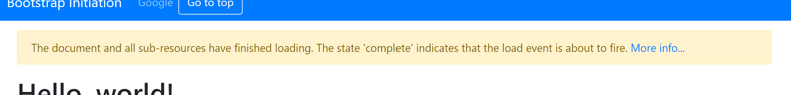
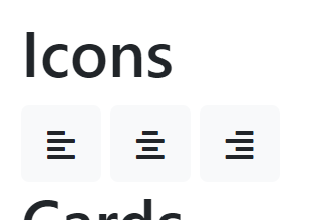

# JavaScript - DOM API

<!-- slide-front-matter class: center, middle -->

## Summary

<!-- slide-include ../../BANNER.md -->

Learn or rediscover how to use the DOM API to manipulate the underlying HTML object structure of a web page.

**You will need**

- [Google Chrome][chrome] (recommended, any browser with developer tools will do)
- [Visual Studio Code][vscode] (recommended, although any editor could do)

**Recommended reading**

- [Course setup][course]
- [Bootstrap][bootstrap]
- [JavaScript][js-bas]

<!-- START doctoc generated TOC please keep comment here to allow auto update -->
<!-- DON'T EDIT THIS SECTION, INSTEAD RE-RUN doctoc TO UPDATE -->

- [Setup](#setup)
- [Document Object Model (DOM)](#document-object-model-dom)
  - [`document` object and event handling](#document-object-and-event-handling)
  - [Example 1 - message alert](#example-1---message-alert)
    - [What have we done?!](#what-have-we-done)
    - [Up to you!](#up-to-you)
  - [Example 2 - alignment buttons](#example-2---alignment-buttons)
    - [Get the buttons](#get-the-buttons)
    - [Align each paragraph](#align-each-paragraph)
  - [Exercice - up to you again!](#exercice---up-to-you-again)
- [Resources](#resources)

<!-- END doctoc generated TOC please keep comment here to allow auto update -->

## Setup

1. Create a new directory in your `dfa-course` project. You can name it whatever you want ; we will call it `js-dom`.

1. Save [this `index.html` file][bsef] in this new `js-dom` directory.

1. Create a new file called `script.js` in `js-dom`.

1. Open `index.html` and add this line at the and of the `<head>` section:
  ```html
  <script src="script.js"></script>
  ```

1. Start `live-server` in this directory and you're good to go!

## Document Object Model (DOM)

The Document Object Model (DOM) is a programming interface for **HTML, XML and SVG documents**.

- provides a structured representation of the **document as a tree**
- defines methods that allow access to the tree, so that they can **change the document structure, style and content**
- provides a representation of the document as a structured group of **nodes and objects**, possessing various **properties and methods**
- allows **event handlers attached to nodes**, and once an event is triggered, the event handlers get executed.

> Essentially, it connects web pages to scripts or programming languages. Although the DOM is often accessed using JavaScript, it is not a part of the JavaScript language.

### `document` object and event handling

The `document` object is the first object of interest, and event handling is key to manage the interaction with the web page. Many possible events are fired during its life cycle and can be listened to.

Let's add the following javascript in `script.js`:

> We know we shall avoid global variable, but for a small example like this, we can be tolerant ...

```js
const content = {
  alertText:
    "The document and all sub-resources have finished loading. The state 'complete' indicates that the load event is about to fire. ",
  alertLink:
    "https://developer.mozilla.org/fr/docs/Web/API/Document/readyState",
};

document.onreadystatechange = () => {
  if (document.readyState === "complete") {
    console.log(content.alertText);
  }
};
```

> See also the [DOM documentation][domdoc] `Document.readyState`

<!-- slide-notes -->

The `document.readyState` property of a document describes the loading state of the document.

### Example 1 - message alert

We want to display a message alert on the top of the page as soon as the document is finished loading.

Let's add a dedicated function:

```js
function alertOnComplete() {
  const newDiv = document.createElement("div");
  newDiv.classList.add("alert", "alert-warning");
  const newText = document.createTextNode(content.alertText);
  newDiv.appendChild(newText);
  const mainContainer = document.querySelector("main.container");
  mainContainer.appendChild(newDiv);
}
```
And call it when the document is ready by changing a line:

```js
document.onreadystatechange = () => {
  if (document.readyState === "complete") {
*   alertOnComplete();
  }
};
```

The result does not completely satisfy the requirement. Indeed, the message alert is shown at the bottom of the page!

#### What have we done?!

Let's see what the code does:

```js
function alertOnComplete() {
* // We create a new `<div>` element
  const newDiv = document.createElement("div");
* // We add some Bootstrap CSS classes to this new div
  newDiv.classList.add("alert", "alert-warning");
* // We create a new text node with the text alert string
  const newText = document.createTextNode(content.alertText);
* // We set this new text node as a child of the new div node
  newDiv.appendChild(newText);
* // We get a list the first "main" element with .container class
  const mainContainer = document.querySelector("main.container");
* // appendChild() appends a node at the end of another node's children
  mainContainer.appendChild(newDiv);
}
```

But we want it on the top (just after the navigation bar). Just replace the last instruction with this one:

```js
mainContainer.insertBefore(newDiv, mainContainer.firstChild);
```

> There are even more methods like `removeChild` or `replaceChild` ...

#### Up to you!

To complete this example, we would like to add a link _"More info..."_ after the text in our alert.

This link should use the `alertLink` property defined on our `content` object to redirect the user.

> Update the `alertOnComplete()` function to add this link element when generating the new alert.

<p class="shadow"></p>

> You should take a look at [`textContent`][text-content] and [`<a>` element][a]

### Example 2 - alignment buttons

<!-- slide-column 60 -->
We want to enable these three alignment buttons we have in our user interface. Using them must align all `<p>` in the web page.

<!-- slide-column 40 -->
<p class="shadow"></p>

<!-- slide-column 100 -->
To do so, we need to add event listeners on those buttons. But we have a problem: how do we **get those specific buttons**?

One option would be to get all the buttons on the page and do some checking in order to try and guess if any of them is the one we want.

> This is not a very reliable technique and we could be smarter than that.

All the buttons we are interested in are **wrapped in a single `<div>`**.

Let's add an `id` to this `<div>`:

```html
<h2>Icons</h2>
<div `id="alignment-btns"`>
  <!-- buttons -->
</div>
```

#### Get the buttons

Now, we can safely get all the buttons inside this `<div>` and be sure they're the ones we want.

```js
function enableAlignmentButtons() {
* // First, we get the wrapping div with the ID
  const wrappingDiv = document.querySelector("#alignment-btns");
* // Then, we get all the buttons inside it
  const buttons = `wrappingDiv`.querySelectorAll("button");
* // For each button in our div...
  for (const button of buttons) {
*   // ...we tell the browser to execute alignAllText once it is clicked
    button.addEventListener("click", alignAllText)
  }
}
```
> Call this function in the `document.onreadystatechange` callback function.

If you run this code now, you'll get a `ReferenceError` on the browser's console:

```
script.js:34 Uncaught ReferenceError: alignAllText is not defined
  at enableAlignmentButtons (script.js:34)
  at HTMLDocument.document.onreadystatechange (script.js:11)
```
> That's normal: we didn't write the `alignAllText()` function. Let's do that now.

#### Align each paragraph

The callback to `addEventListener()` is always called with one argument, which is the event itself.

Our `alignAllText()` function should then take this event as a parameter. We will use it to detect which button was actually clicked:

```js
function alignAllText(event) {
* // currentTarget is the clicked button. The first child nodes is its icon
  const icon = event.currentTarget.childNodes[0];
* // With classList we can detect the type of the icon, and deduce the alignment
  let alignment;
  if (icon.classList.contains("fa-align-left")) {
    alignment = "left";
  } else if (icon.classList.contains("fa-align-center")) {
    alignment = "center";
  } else if (icon.classList.contains("fa-align-right")) {
    alignment = "right";
  }
* // We get all the paragraphs of the document
  const pColl = document.getElementsByTagName("p");
* // For each of them...
  for (const p of pColl) {
*   // We remove any text alignment class
    p.classList.remove("text-left", "text-center", "text-right");
*   // We add an alignment class using the previously deduced alignment
    p.classList.add(\`text-${alignment}`);
  }
}
```

### Exercice - up to you again!

We want to play with the form and the table we have in the user interface.

The requirements are that when a user submits the form by clicking on the "Register" button, we:
- get the value of the First name and Last name fields ;
- add a new row to the Table at the bottom of the page with those values in the right columns (give the `#` and `Startship` column a value of `###`).

> Good luck! And to help you:

> 1. Add a listener either on the form's submit event or the button's click event ;
> 1. In the callback function, start by getting the values from the fields
> 1. Then create the required HTML node tree for a new table row, filling in the values in the cells

> Do not hesitate to update the HTML code by adding ids or classes if this helps you. But don't overdo it!

## Resources

You will find the final HTML file for this course [here][fef]

**Documentation**

- [DOM documentation][domdoc]

[domdoc]: https://developer.mozilla.org/en-US/docs/Web/API/Document_Object_Model
[bootstrap]: ../bootstrap
[js-bas]: ../js
[course]: ../setup
[chrome]: https://www.google.com/chrome/
[vscode]: https://code.visualstudio.com/
[bsef]: https://gist.githubusercontent.com/Tazaf/18732ef01164f7b6348443c4c4748f42/raw/ecae62ab21eca302bcbfc0ffef8df1fd30d9e6af/index.html
[fef]: https://gist.githubusercontent.com/Tazaf/e7286440370e1c5197999b0da2e84f9e/raw/f1765006a58b7bff78c0dbe05739227734b23ebf/index.html
[text-content]: https://developer.mozilla.org/fr/docs/Web/API/Node/textContent
[a]: https://developer.mozilla.org/fr/docs/Web/HTML/Element/a
