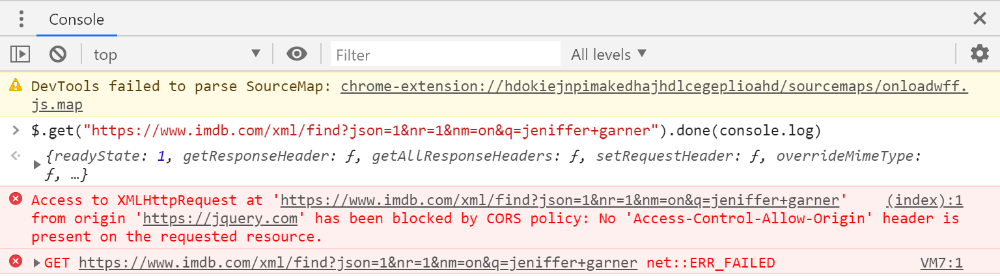

# SOP and CORS

Lean about **security measures** when communicating with RESTful APIs from your JavaScript code, and how to **deal with them**.

<!-- slide-include ../../BANNER.md -->

**You will need**

- [Google Chrome][chrome] (recommended, any browser with developer tools will do)

**Recommended reading**

- [RESTful APIs][rest]
- [Asynchronous API calls][api-call]

<!-- START doctoc generated TOC please keep comment here to allow auto update -->
<!-- DON'T EDIT THIS SECTION, INSTEAD RE-RUN doctoc TO UPDATE -->


- [Your request has been blocked](#your-request-has-been-blocked)
- [Same-origin policy (SOP)](#same-origin-policy-sop)
  - [Why does SOP protect the final user?](#why-does-sop-protect-the-final-user)
  - [What if I'm developing on my computer?](#what-if-im-developing-on-my-computer)
- [But... I need to call my API!](#but-i-need-to-call-my-api)
- [Cross-Origin Resource Sharing (CORS)](#cross-origin-resource-sharing-cors)
  - [Simple CORS example](#simple-cors-example)
- [Proxy](#proxy)
- [Resources](#resources)

<!-- END doctoc generated TOC please keep comment here to allow auto update -->

## Your request has been blocked

When you start to integrate with RESTful APIs, wether your own or public ones, with a front-end application, you'll very probably stumble upon an infamous error message, right after you executed a request:

```
Access to XMLHttpRequest at 'https://webservice.api/foo'
from origin 'https://web-app.com' has been blocked by CORS policy:
  No 'Access-Control-Allow-Origin' header is present on the requested resource.
```
> This error message is strangely both understandable and cryptic.

The easy part is that your request has been **blocked out**: you didn't receive any response.

What is more confusing is this `CORS policy` and missing `Access-Control-Allow-Origin` header.

### I want to see for myself!

To see by your own eyes what we are talking about, go to https://jquery.com/ and open the developer console.

Copy and paste this code in the console and execute it:

```js
$.get("https://www.imdb.com/xml/find?json=1&nr=1&nm=on&q=jeniffer+garner").done(console.log)
```
> This is how you would do a GET request when using jQuery

You should see the following error:

<p class="center shadow"></p>

## Same-origin policy (SOP)

Our problem is caused by an important concept for web application security in place since the 90': the **Same Origin Policy**.

It stipulates that a resource on a webpage can access and interact with a resource on another webpage **only if both of them have the same origin**.

> "What is a _same origin_?" you might ask

It's the part of their URL composed of the **protocol**, **host** and **port**. If those three values are equals for two resources, then they share the same origin.

Suppose we have a resource at `http://www.mas-rad.ch/programme/cas-dar.aspx`:

| Other URL | Same Origin? |
| --- | --- |
| `http://www.mas-rad.ch` | Yes! |
| _**`https`**_`://www.mas-rad.ch/contact.aspx` | Nope... (different `protocol`) |
| `http://`_**`www.cyberlearn.ch`**_ | Nope... (different `host`) |
| `http://`_**`site`**_`.mas-rad.ch`| Nope... (different `host`) |

### Why does SOP protect the final user?

What if _Same Origin Policy_ was not the default behaviour?

- **All cookies**, often used to authenticate sessions, could be accessed from any page
- Malicious website **could iframe legit websites** (like an e-banking) and interact with the content of this website (e.g. login form content, transaction recipient, account balance, ...)
- Other very serious issues...

The _Same Origin Policy_ does apply to:

- Cookies
- Asynchronous requests
- DOM
- Data storage (e.g. `localStorage`)

> It's important to understand that SOP **only** applies when a **browser** does the request.

### What if I'm developing on my computer?

Suppose, and it's not far fetched, that your front end is running on `http://localhost:4200`, and your back end is running on `http://localhost:3000`.

Event if both of them are running on your machine, and thus completely under your control and out of the real world wide web, remember that SOP inspect `protocol`, `host` **and `port`**.

In our example, the port **are different** (`4200` vs `3000`).

Requests from your front end to your back end would be blocked by the browser all the same.

> You won't be affected if your RESTful API and your front end are running on the exact same `localhost` port.

## But... I need to call my API!

Sometimes the Same Origin Policy is too restrictive.

- Many web applications require to interact **with different origins** through http requests
- If those **origins are trusted**, why would'nt it be possible?

Ther's two main ways to work with SOP and still access the data.

- Using [the **Cross-Origin Resource Sharing** mechanism][cors]
- Using a [Proxy][proxy]

## Cross-Origin Resource Sharing (CORS)

This is a mechanism that greenlights request under certain circumstances.

It works by using some new headers that controls if and how a cross-origin request is allowed.

The basics are:

- Client sends a request by adding an `Origin` header with its own origin
- Server sends a response with a header `Access-Control-Allow-Origin` indicating which origins are allowed
- The browser then decides if it allows the client to access the content of the response based on those two headers

### Simple CORS example

Let's suppose that a page loaded from `https://page-a.com` :

- Sends an HTTP `OPTIONS` request to `https://page-b.com/api` with the following header
  ```
  Origin: https://page-a.com
  ```
- Receive a response from `https://page-b.com/api` with the following header
  ```
  Access-Control-Allow-Origin: *
  ```
  > The `*` means that any origin is allowed to call `https://page-b.com/api`
- Then the request is allowed by the browser to be accessed by the page at `https://page-a.com`

## Proxy

Since the backend application must send **an additional header** in its response, you won't be able to use CORS to bypass SOP if the API you're calling **is not under your control**.

In this case, you have to remember that SOP **only applies** when the request is executed from **a browser**.

> Communication

A proxy is a backend application to which the front end will **delegate the call**, and that will **relay the response** back to it, effectively bypassing SOP since the actual request happened outside a browser.

> The proxy must obviously be **on the same origin than the front end**, or send itself the `Access-Control-Allow-Origin` header. Otherwise, it's not much use...

## Resources

- [MDN - Same Origin Policy][sop]
- [MDN - Cross Origin Resource Sharing][cors]
- [CORS Anywhere][cors-anywhere] (An API to proxy requests)

[api-call]: ../api-call
[chrome]: https://www.google.com/chrome/
[cors]: https://developer.mozilla.org/en-US/docs/Web/HTTP/CORS
[cors-anywhere]: https://cors-anywhere.herokuapp.com/
[proxy]: https://fr.wikipedia.org/wiki/Proxy
[rest]: ../rest
[sop]: https://developer.mozilla.org/fr/docs/Web/Security/Same_origin_policy_for_JavaScript
